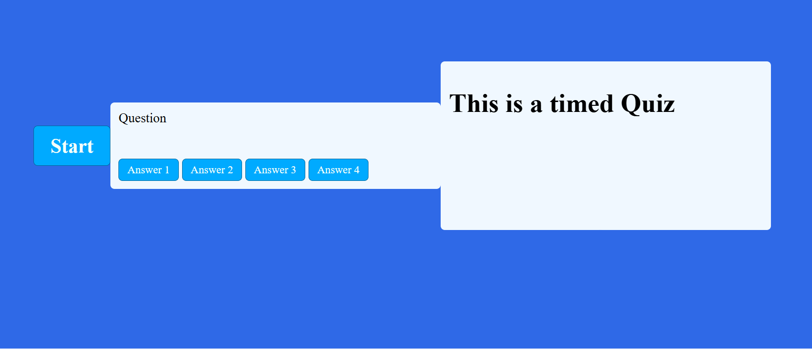

# 🚀 Code Quiz Challenge

Put your coding knowledge to the test in a fast-paced, timed quiz built for aspiring developers.

## 🎯 Overview
Code Quiz Challenge is a browser-based trivia game focused on core web development concepts. Race against the clock, answer questions, and aim for a top score.

## ✨ Features
- ⏱️ **Timed gameplay** for extra intensity
- ❌ **Time penalty** for incorrect answers
- 🔁 **Randomized question order** each round
- 🏁 **Score submission** with player initials
- 💾 **High-score ready experience**

## 🕹️ How It Works
1. Click **Start** to begin the quiz.
2. Read each question and select the best answer.
3. Correct answers keep you moving.
4. Wrong answers subtract time from the clock.
5. Finish all questions (or run out of time), then submit your initials.

## 🛠️ Tech Stack
- HTML
- CSS
- JavaScript

Link:  https://maxkarltun.github.io/code-quiz/
_____________________________________________________________________________________________________________________________________________________________
## 📁 Repository
https://github.com/MaxKarltun/code-quiz

## 🤝 Contributing
Suggestions and improvements are welcome. Feel free to open an issue or submit a pull request.

## 🧪 Tests
No formal automated tests yet.

## 📄 License
This project is open source and inspired by coding bootcamp challenge material.
